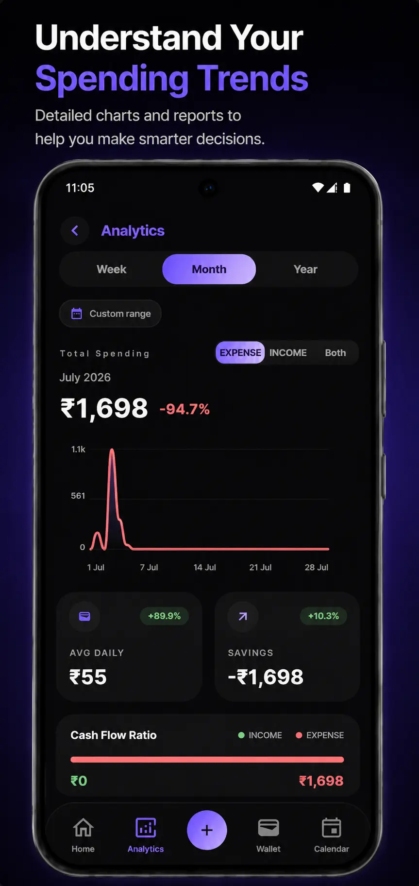
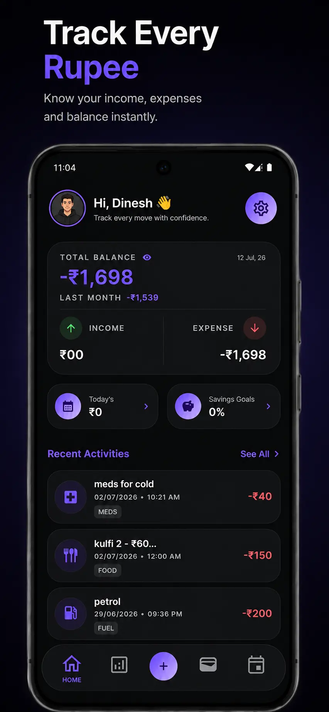
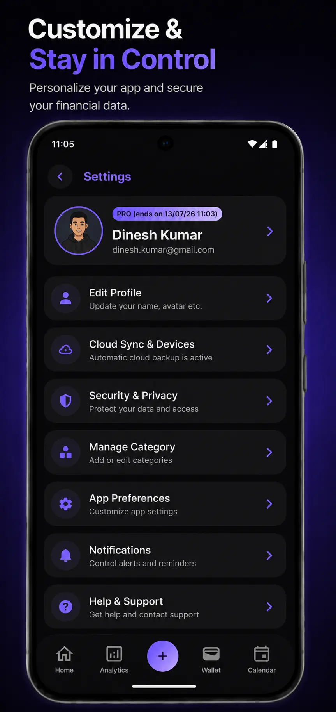
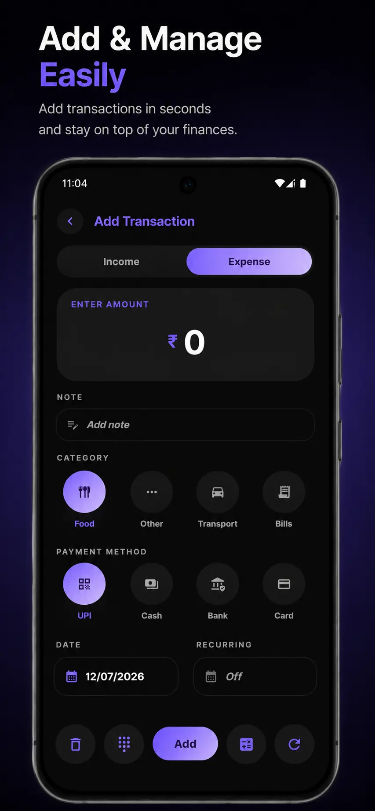
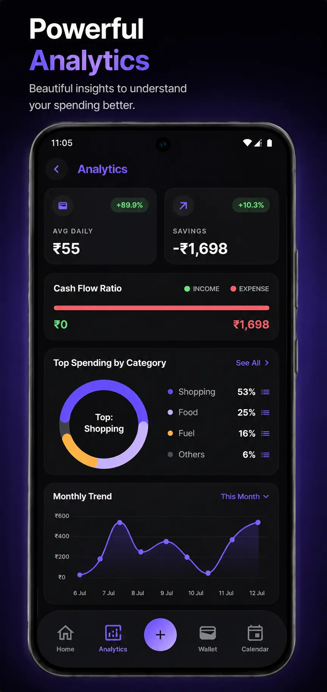

<div align="center">

# 💰 Expense Tracker: Budget & Spend

**An elegant, offline-first personal finance app for Android — built with Jetpack Compose & Material 3.**

    


*Elegance in every transaction.*

</div>

---

## 📱 About

**Expense Tracker: Budget & Spend** is a privacy-focused personal finance app. Track daily spending in seconds with an optimized keypad, plan monthly budgets, visualize your habits with rich analytics, and keep your data secure with PIN/biometric app lock. The app is **offline-first** — your data never leaves your device unless you choose to sign in and enable cross-device cloud sync.

| | |
|---|---|
| **Application ID** | `com.mknlabs.expensetracker` |
| **Version** | 2.58.1 (152) |
| **Min SDK / Target SDK** | 24 / 36 |
| **Language** | 100% Kotlin |
| **UI** | Jetpack Compose (Material 3) |
| **Architecture** | MVVM · Clean-style (data / domain / ui) |

---

## 📸 Screenshots

| | | |
|---|---|---|
|  |  |  |
|  |  |  |

---

## ✨ Features

### 🧾 Transactions
- Log **income & expenses** in seconds with a dedicated amount keypad
- Add **notes**, **categories** (50 icons, fully customizable), and **payment methods/wallets**
- **Itemized calculator** — break one payment into multiple line items
- Advanced **search, sort & multi-filter** (date range, amount range, category, payment mode, type, order)
- Fully customizable **transaction cards** (icons, labels, date/time visibility, grouping)

### 📊 Budget & Goals
- **Monthly category budgets** with caps, spent/remaining/over tracking and limit alerts
- **Recurring transactions** — daily/weekly/monthly/yearly frequencies, repeat counts & installment tracking
- **Savings goals** with progress tracking

### 📈 Analytics
- Weekly / monthly / yearly / **custom range** analytics
- Spending trends, growth index, cash-flow ratio, average daily spend
- **Top spending** by category & payment mode, full category/payment breakdowns
- Smart **spending insights** with actionable tips

### 🗓️ Calendar
- Year & month views with per-day spending overview
- Jump-to-date navigation and month/year pickers

### 🔒 Security & Privacy (offline-first)
- **App lock**: 4-digit PIN, biometric (fingerprint/face), scrambled keypad, security-question recovery
- **Block screenshots**, **blur in recents**, configurable auto-lock duration
- Data stored locally (Room + encrypted DataStore); never uploaded unless you sign in
- **Server-verified Pro**: ProPass redemption runs through a trusted Cloud Function — Pro status can only be granted server-side, never tampered with on-device

### ☁️ Cloud Sync & Data Management
- Sign in with **Google, email/password, or magic link** (deep-link support)
- **Cross-device sync** via Firebase Firestore (see connected devices)
- **JSON export/import** (merge-safe), **SQLite `.db` backup/restore**, **legacy app import**
- **Automated backups** via WorkManager with configurable frequency

### 🔔 Notifications
- Daily spend reminders, budget-limit alerts, missed-entry reminders

### 🎨 Personalization
- **Multi-currency** support with country search
- Number format (Indian/International grouping), decimal places, date & time formats
- System / Light / Dark themes, profile (avatar, DOB, gender), customizable categories

### 👑 Monetization
- **AdMob** (native, interstitial, rewarded) with **UMP** consent management
- **Pro membership** (server-verified Pro Pass redemption) unlocking: ad-free UI, advanced analytics, recurring rules, cloud sync & auto backup
- Watch-a-rewarded-ad to unlock 1-hour ad-free Pro access

---

## 🛠️ Tech Stack

| Layer | Technology |
|---|---|
| **Language** | Kotlin 2.2.10 |
| **UI** | Jetpack Compose, Material 3, Material Icons Extended, Splash Screen API |
| **DI** | Hilt (with Hilt-ViewModel & Hilt-Worker) |
| **Local DB** | Room 2.8.4 (KSP), DataStore Preferences |
| **Backend** | Firebase Auth, Firestore, Remote Config, Analytics, Cloud Functions (ProPass redemption), Google Sign-In |
| **Background** | WorkManager (sync, recurring rules, auto-backup, notifications) |
| **Ads** | Google AdMob + User Messaging Platform (UMP) |
| **Security** | Android Biometric, Security Crypto (EncryptedSharedPreferences), PBKDF2 PIN hashing with lockout, Keystore AES-256-GCM encrypted DataStore & backups, root/emulator detection, server-authoritative Pro (Cloud Function) |
| **Performance** | Baseline Profiles (separate `:baselineprofile` module) |
| **Build** | Gradle 9.5 · AGP 9.3.1 · Version Catalog (`gradle/libs.versions.toml`) |

---

## 🏗️ Architecture

The app follows a **Clean-style MVVM** architecture with a one-way data flow:

```
UI (Compose) → ViewModel (UiState) → UseCase → Repository → Data Source (Room / Firebase / DataStore)
```

- **`ui/`** — Compose screens, components, navigation, themes & ViewModels
- **`domain/`** — use cases & repository interfaces (business rules)
- **`data/`** — Room entities/DAOs, repository implementations, DataStore, Firestore sync, legacy import
- **`di/`** — Hilt modules (Database, Auth, DataStore, Firebase, Monetization, Repository)
- **`workers/`** — WorkManager workers (cloud sync, recurring transactions, auto-backup, notifications)
- **`notifications/`** — dynamic notification engine & scheduling
- **`monetization/`** — ads coordinator, feature registry & access-level gating

```
📦 com.mknlabs.expensetracker
 ┣ 📂 data          # Room, repositories, DataStore, Firestore sync
 ┣ 📂 di            # Hilt modules
 ┣ 📂 domain        # Use cases & repository contracts
 ┣ 📂 monetization  # Ads + Pro feature gating
 ┣ 📂 notifications # Notification engine & workers
 ┣ 📂 ui            # Screens, components, navigation, theme, viewmodels
 ┣ 📂 utils         # Formatting, sorting, auth helpers
 ┣ 📂 workers       # WorkManager background tasks
```

---

## 🚀 Getting Started

### Prerequisites

- **Android Studio** (latest stable, with **JDK 21** — see `gradle/gradle-daemon-jvm.properties`)
- **Android SDK 36**
- A [Firebase](https://firebase.google.com) project (for auth, sync & analytics)

### 1. Clone & build

```bash
git clone <your-repo-url>
cd ExpenseTracker

# Build debug APK
./gradlew :app:assembleDebug

# Run unit tests
./gradlew :app:testDebugUnitTest
```

### 2. Add your Firebase config

The repository **does not include** `app/google-services.json` (it contains your Firebase API keys and is git-ignored).

1. Create a project in the [Firebase Console](https://console.firebase.google.com)
2. Add an **Android app** with package name `com.mknlabs.expensetracker`
3. Download the generated `google-services.json` into the `app/` folder
4. Enable **Firebase Authentication** (Email/Password, Google, and Dynamic Links/Magic Link) and **Cloud Firestore**

### 3. Deploy Cloud Functions & Firestore rules (required for Pro Pass)

```bash
cd functions && npm install
firebase login
firebase deploy --only functions,firestore:rules
```

> ⚠️ Cloud Functions requires the Firebase **Blaze** (pay-as-you-go) plan — it is not available on the free Spark plan. The `redeemProPass` function and the hardened Firestore rules must be deployed before Pro Pass redemption works in a build.

### 4. AdMob (optional)

Add your own **AdMob App ID** and ad-unit IDs. Ad unit IDs currently live in:

- `AndroidManifest.xml` → `com.google.android.gms.ads.APPLICATION_ID`
- `monetization/AdsCoordinator.kt` → native/interstitial/rewarded ad unit constants

> ⚠️ Test ads (`ca-app-pub-3940256099942544/...`) are included for development — replace them with your production IDs before release.

---

## 🧪 Testing

Unit tests live under `app/src/test/` covering:

- Amount formatting & currency utilities
- Date/time utilities
- Category ranking & string utilities
- Navigation utilities
- ViewModels (Analytics, Preferences, Transactions)
- Transaction presentation mapper

Run them with:

```bash
./gradlew :app:testDebugUnitTest
```

---

## 📄 License

Copyright © 2026 **Manish Nayak**. **All rights reserved.**

This project is proprietary and is **not** licensed for redistribution, modification, or commercial use. See the [LICENSE](LICENSE) file for the full terms.

---

## 🙌 Contributing

This is a personal project, but issues, feature requests, and ideas are welcome via GitHub Issues.
