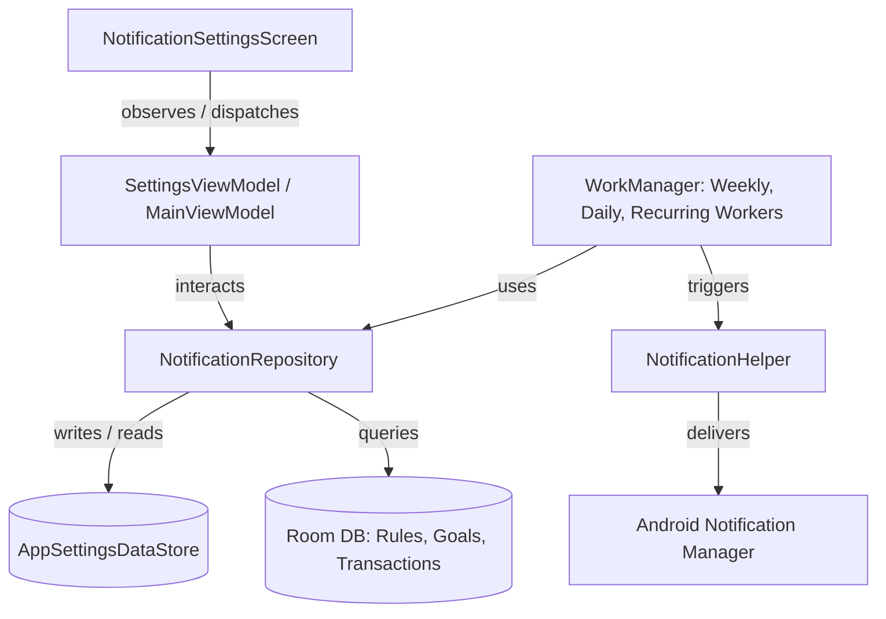

# Notification System Upgrade - Master Implementation Plan (v4)

This document maps out the structured plan to upgrade the Expense Tracker Notification System, aligning the existing system with the requirements in `notification_system_master_specification_v4.md`.

---

## 1. Current State vs. Target State Audit

### Already Implemented:
*   **Notification Helper:** [NotificationHelper.kt](file:///C:/Users/mkn00/AndroidStudioProjects/ExpenseTracker/app/src/main/java/com/mknlabs/expensetracker/notifications/NotificationHelper.kt) creates channels for `daily_reminders`, `budget_alerts`, and `recurring_transactions`.
*   **Dynamic Engine:** [DynamicNotificationEngine.kt](file:///C:/Users/mkn00/AndroidStudioProjects/ExpenseTracker/app/src/main/java/com/mknlabs/expensetracker/notifications/DynamicNotificationEngine.kt) generates random/sarcastic strings.
*   **Background Workers:** 
    *   [NotificationWorker.kt](file:///C:/Users/mkn00/AndroidStudioProjects/ExpenseTracker/app/src/main/java/com/mknlabs/expensetracker/notifications/NotificationWorker.kt) runs daily reminder & missed entry logic.
    *   [RecurringTransactionWorker.kt](file:///C:/Users/mkn00/AndroidStudioProjects/ExpenseTracker/app/src/main/java/com/mknlabs/expensetracker/workers/RecurringTransactionWorker.kt) pushes upcoming bill reminders (48-hour window).
*   **UI Settings:** [NotificationSettingsScreen.kt](file:///C:/Users/mkn00/AndroidStudioProjects/ExpenseTracker/app/src/main/java/com/mknlabs/expensetracker/ui/screens/NotificationSettingsScreen.kt) contains 3 basic toggles.

### Gaps to Implement:
1.  **Categories expansion:** Transition from 3 toggles to 8 unified parent categories (4 Free, 4 Premium).
2.  **Settings customization:** Store and configure user-defined times (daily reminder, weekly summary) and large transaction threshold value.
3.  **Room Schema Migration:** Add `notificationsEnabled: Boolean` to recurring rules.
4.  **Weekly Summary:** Create a dedicated worker calculating Sunday spending statistics.
5.  **Insights & Savings Goal Alerts:** Create algorithms/workers to verify goal timelines and spending spike triggers.
6.  **Premium UI Enhancements:** Integrate ⭐ and ⓘ controls on the settings screen.

---

## 2. Layer-by-Layer Architectural Blueprint



### A. Data Layer (Room & DataStore)
*   **Database Migration (Version 8 ➔ 9):**
    *   Alter `recurring_rules` table: Add `notifications_enabled` (`INTEGER NOT NULL DEFAULT 1`).
    *   Update [RecurringRuleEntity.kt](file:///C:/Users/mkn00/AndroidStudioProjects/ExpenseTracker/app/src/main/java/com/mknlabs/expensetracker/data/local/room/entities/RecurringRuleEntity.kt) to match.
*   **AppSettingsDataStore Changes:**
    *   Add fields:
        *   `expenseRemindersEnabled: Boolean` (Default `true`)
        *   `budgetAlertsEnabled: Boolean` (Default `true`)
        *   `largeTransactionAlertsEnabled: Boolean` (Default `true`)
        *   `weeklySummaryEnabled: Boolean` (Default `true`)
        *   `financialInsightsEnabled: Boolean` (Default `true`)
        *   `savingsGoalsEnabled: Boolean` (Default `true`)
        *   `billRemindersEnabled: Boolean` (Default `true`)
        *   `cloudSecurityEnabled: Boolean` (Default `true`)
        *   `expenseReminderTimeMillis: Long` (Default `20:00` / 8:00 PM equivalent)
        *   `weeklySummaryTimeMillis: Long` (Default Sunday `20:00`)
        *   `largeTransactionThresholdMinor: Long` (Default `500000` / ₹5,000 equivalent)

### B. Domain Layer (Repository & Models)
*   **NotificationRepository Interface:**
    *   Contract declaring methods to query preferences, update toggles, log notification occurrences, and request aggregate statistical snapshots.
*   **Pure Kotlin Use Cases:**
    *   `CheckLargeTransactionUseCase`
    *   `GenerateWeeklyReportUseCase`
    *   `AnalyzeInsightsUseCase`

### C. Data Layer Implementation (Repository & Background Tasks)
*   **NotificationRepositoryImpl:**
*   Interacts with room databases and datastores. Provided via `@Provides` inside Hilt modules.
*   **Notification Channel Updates:**
    *   Replace channels in [NotificationHelper.kt](file:///C:/Users/mkn00/AndroidStudioProjects/ExpenseTracker/app/src/main/java/com/mknlabs/expensetracker/notifications/NotificationHelper.kt) to define the 7 required channels with correct importance flags.
*   **WorkManager Jobs (Simplified Engine Integration):**
    *   `DailyReminderWorker`: Reads `expenseReminderTimeMillis` and schedules exact daily checks.
    *   `WeeklySummaryWorker`: Scheduled for Sundays at 8:00 PM. Queries transactions for the past week, compiles aggregates, and pushes summary alerts.
    *   `GoalMilestoneWorker`: Daily check comparing progress limits and calculating behind-schedule flags.
    *   `RecurringTransactionWorker` **(Refactored for Category 7):** Do not create a separate recurring reminder engine. Instead, refactor the existing upcoming bill logic:
        *   Gate execution by checking the global `billRemindersEnabled` setting from the DataStore.
        *   Query and filter rules checking `notificationsEnabled` database flag is `true`.
        *   Expand the advance notification window to evaluate and dispatch warning alerts at exactly **7 Days, 3 Days, 1 Day, and on the Due Date** before `nextRunAt`, instead of the current hardcoded 48-hour window.

### D. ViewModel Layer
*   **SettingsViewModel:**
    *   Exposes a state flow combining DataStore configuration with the user's Subscription Tier (Premium/Free).
    *   Dispatches background update events when settings toggles are clicked.

### E. UI Layer (Jetpack Compose)
*   **NotificationSettingsScreen Enhancements:**
    *   Replaces basic toggles with 8 cards wrapped in a unified scrollable list.
    *   Each toggle includes an Information icon (`IconButton` + `Icons.Rounded.Info`) that triggers a themed `ModalBottomSheet` or dynamic dialog summarizing the nested notification subtypes.
    *   Premium indicators (⭐) show lock states for categories 5–8 when user tier is `FREE`. Clicking a Premium toggle triggers the upgrade screen.
    *   Time selection and threshold input options appear conditionally when their respective categories are enabled.


---

## 3. Recommended Execution Phases

```
[Phase 1: DB Schema & Preferences] ➔ [Phase 2: Repository & Domain Contracts] ➔ 
[Phase 3: Logic Engine & Workers]  ➔ [Phase 4: ViewModel Event Binding]      ➔ 
[Phase 5: Screen UI Updates]        ➔ [Phase 6: Testing & Validation]
```

### Phase 1: DB Schema & Preferences
*   Define the DB schema migration from Version 8 to 9.
*   Extend settings DataStore keys to hold the 8 categories, times, and threshold constraints.

### Phase 2: Repository & Domain Contracts
*   Create repository interfaces and inject dependencies via Hilt.
*   Integrate `notificationsEnabled` fields into saving/updating rules.

### Phase 3: Logic Engine & Workers
*   Update channels inside `NotificationHelper`.
*   Implement `WeeklySummaryWorker`, `DailyReminderWorker`, and `GoalMilestoneWorker`, and refactor `RecurringTransactionWorker` to support the multi-day alert windows (7, 3, 1 days & due date).
*   Integrate threshold checks in transaction repository insertion logic.

### Phase 4: ViewModel Event Binding
*   Wire UI settings actions to update preferences asynchronously in the ViewModels.

### Phase 5: Screen UI Updates
*   Revamp `NotificationSettingsScreen` with the 8 cards, Star badges, Info sheets, and time/threshold inputs.

### Phase 6: Testing & Validation
*   Verify permissions (Android 13+ runtime requests).
*   Test reboot triggers, timezone updates, offline queuing, and premium toggle constraints.

---

## 4. Inventory of Unique Notifications

The upgraded notification ecosystem consists of **33 unique notification triggers** mapped across the 8 categories:

### 1. Expense Reminders (Free)
*   **Daily Expense Reminder:** Daily evening prompt (default 8:00 PM) encouraging the user to log transactions.
*   **Missed Entry Reminder:** Triggered in the evening if no transaction has been added for the current date.

### 2. Budget Alerts (Free)
*   **Budget Warning (75%):** Fired when a category or overall monthly spending crosses 75% of the limit.
*   **Budget Warning (90%):** Fired when a category or overall monthly spending crosses 90% of the limit.
*   **Budget Reached (100%):** Fired when category/monthly spending exactly matches the budget limit.
*   **Budget Exceeded:** High-importance alert fired when a transaction pushes spending past the budget ceiling.

### 3. Large Transaction Alerts (Free)
*   **Large Expense Detection:** Triggered immediately when a single transaction amount is greater than the user's custom threshold.

### 4. Weekly Summary (Free)
*   **Weekly Spending Summary:** Scheduled Sunday at 8:00 PM, compiling spending summaries and comparison dynamics over the previous 7 days.

### 5. Financial Insights (Premium ⭐)
*   **Spending Trend Analysis:** Regular notification summarizing month-over-month or category-over-category changes.
*   **Spending Spike Detection:** Notifies user of an unusual or sudden increase in transaction velocity.
*   **Highest Spending Category:** Periodic summary highlighting where the majority of funds are allocated.
*   **Spending Pattern Detection:** Detects and notifications on recurring times or habits.
*   **Financial Health Reports:** Low-importance rating updates on budget compliance and financial performance.
*   **Monthly Spending Insights:** Monthly review of total spending behaviors.
*   **Monthly Savings Insights:** Monthly analysis of saved capital.
*   **Spending Forecast:** Predictions of future monthly expenditure based on historic lines.
*   **Savings Forecast:** Projections of target savings bounds.
*   **Budget Risk Prediction:** Warnings about which budgets are mathematically predicted to fail before month-end.
*   **Smart Budget Recommendations:** Automated configuration advice for user budgets.
*   **Personalized Savings Suggestions:** Algorithmic recommendations pointing out areas where the user can cut spending.

### 6. Savings Goals (Premium ⭐)
*   **Goal Progress:** Triggered at major milestones (e.g. 25%, 50%, 75% of target).
*   **Goal Achieved:** Fired immediately when the saved amount matches or exceeds the target.
*   **Goal Behind Schedule:** Warning when average contributions fall below the velocity required to meet the goal deadline.

### 7. Bill & Subscription Reminders (Premium ⭐)
*   **Upcoming EMI Alert:** Scheduled reminder for loan repayments.
*   **Upcoming Rent Alert:** Scheduled reminder for monthly tenancy payments.
*   **Upcoming Electricity Alert:** Scheduled reminder for power utilities.
*   **Upcoming Internet Alert:** Scheduled reminder for ISP billing.
*   **Upcoming Insurance Alert:** Scheduled reminder for coverage premiums.
*   **Upcoming Subscription Renewal Alert:** Warning for streaming services, domain renewals, etc.
*   *Note: Each of the above alerts triggers up to 4 times per billing cycle: 7 Days Before, 3 Days Before, 1 Day Before, and on the Due Date.*

### 8. Cloud & Security Alerts (Premium ⭐)
*   **Sync Failed:** High-priority warning triggered when cloud synchronization encounters a persistent exception.
*   **Sync Pending:** Notification highlighting unsynced local data queued after a long offline period.
*   **Backup Failure:** Warning if auto-backup to cloud storage fails.
*   **New Device Login:** High-priority security warning when a new Android hardware ID is registered to the profile.
*   **Password Changed:** Confirmation of account credential update.
*   **Email Changed:** Confirmation of account email update.
*   **Account Recovery Attempt:** High-priority security warning when an unauthenticated recovery stream is initiated.

